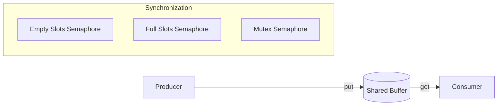

# Operating Systems - 4/14/26

## 1\. Synchronization Fundamentals

Synchronization is essential in concurrent programming to prevent **race conditions**, where the final outcome of execution depends on the specific order in which instructions are interleaved.

### The Critical Section Problem

A **Critical Section (CS)** is a segment of code where a process/thread accesses shared resources (e.g., global variables, shared memory).

- **Entry Section:** Requests permission to enter the CS.

- **Critical Section:** Executes the code accessing shared resources.

- **Exit Section:** Releases permission to allow other threads to enter.

- **Remainder Section:** Executes non-critical code.

> **Teacher's Probing Question:** Why is "bounded waiting" a critical requirement for a synchronization solution?

---

## 2\. Uniprocessor Solutions: Disabling Interrupts

On a uniprocessor system, concurrency is achieved through context switching, which is triggered by interrupts (e.g., timer interrupts).

### Implementation

```c
DISABLE_INTERRUPTS();
// --- Critical Section ---
ENABLE_INTERRUPTS();
// --- Remainder Section ---
```

### Limitations

- **Inefficiency:** Disabling interrupts is time-consuming and can degrade system performance.

- **Clock Problems:** Interrupt disabling can interfere with the system clock and time-keeping.

- **Machine Dependency:** The instruction set for interrupt control varies across architectures.

- **Security:** User-level programs should not be allowed to disable interrupts, as they could monopolize the CPU.

---

## 3\. Hardware-Assisted Synchronization

Modern architectures provide hardware support for synchronization through **atomic instructions**, which are non-interruptible.

### 3\.1. TestAndSet

The `TestAndSet` instruction tests and modifies the content of a memory word atomically.

**Conceptual Implementation:**

```c
boolean TestAndSet (boolean *target) {
    boolean rv = *target;
    *target = TRUE;
    return rv;
}
```

**Usage with a Lock:**

```c
while (TestAndSet(&lock)); // Busy-waiting
// --- Critical Section ---
lock = FALSE;
```

### 3\.2. Swap (Exchange)

The `Swap` instruction atomically exchanges the values of two memory words.

**Usage with a Lock:**

```c
// Each thread has a local 'key' set to TRUE
while (key == TRUE) {
    Swap(&lock, &key);
}
// --- Critical Section ---
lock = FALSE;
```

### Drawbacks of Hardware Solutions

1. **Busy-Waiting:** Threads consume CPU cycles while waiting for the lock (Spinlocks).

2. **Not Bounded-Waiting:** There is no guarantee that a waiting thread will eventually gain access (starvation is possible).

3. **Architecture Dependent:** Implementing synchronization primitives across different hardware can be complex.

---

## 4\. Semaphores

A **Semaphore** is an synchronization tool that avoids busy-waiting by blocking threads.

### 4\.1. Definition

A semaphore `S` is an integer variable that, apart from initialization, is accessed only through two atomic operations: `wait()` and `signal()`.

| Operation                                                     | Alternative Names                                             | Logic                                                         |
| ------------------------------------------------------------- | ------------------------------------------------------------- | ------------------------------------------------------------- |
| **`wait(S)`**                                                 | **P()**, **down()**, **acquire()**                            | Decrements `S`. If `S &lt; 0`, the thread is blocked.         |
| **`signal(S)`**                                               | **V()**, **up()**, **post()**, **release()**                  | Increments `S`. If `S &lt;= 0`, it wakes up a blocked thread. |

### 4\.2. Implementation (Non-Busy-Waiting)

To avoid busy-waiting, semaphores maintain a waiting queue of processes.

- **`block()`**: Suspends the current process and moves it to the semaphore's waiting queue.

- **`wakeup()`**: Removes a process from the waiting queue and moves it to the ready queue.

### 4\.3. Types of Semaphores

- **Binary Semaphore:** The value ranges only between 0 and 1. Used as a **Mutex Lock**.

- **Counting Semaphore:** The value can range over an unrestricted domain. Used to manage resources with a finite number of instances.

*Note: In academia, a Mutex is often equated to a binary semaphore. In industry (e.g., pthreads), `pthread_mutex_t` includes additional features like ownership and recursion.*

---

## 5\. The Producer-Consumer Problem

This is a classical synchronization problem involving a shared buffer.

### Constraints

1. **Mutual Exclusion:** The producer and consumer cannot access the buffer simultaneously.

2. **Buffer Underflow:** The consumer cannot consume items if the buffer is empty.

3. **Buffer Overflow:** The producer cannot add items if the buffer is full.

### Visualizing the Buffer Logic



> **Teacher's Probing Question:** How many semaphores are required to solve the Producer-Consumer problem with a bounded buffer of size *N*?

